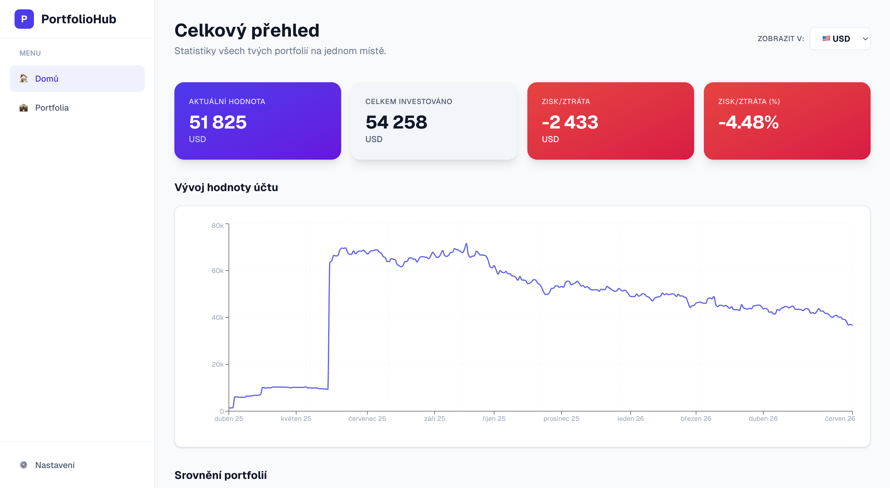

# PortfolioHub

Webová aplikace pro správu a sledování investičního portfolia. Umožňuje uživatelům evidovat nákupy a prodeje akcií, ETF a kryptoměn napříč libovolným počtem portfolií, sledovat jejich aktuální hodnotu v reálném čase a analyzovat historický vývoj.

Aplikace vznikla jako praktická část bakalářské práce na VŠE (Fakulta informatiky a statistiky).

🔗 **Živá verze:** [portfoliohub-xi.vercel.app](https://portfoliohub-xi.vercel.app)



---

## Obsah

- [Hlavní funkce](#hlavní-funkce)
- [Použité technologie](#použité-technologie)
- [Architektura](#architektura)
- [Spuštění projektu lokálně](#spuštění-projektu-lokálně)
- [Struktura projektu](#struktura-projektu)
- [Datový model](#datový-model)
- [Známá omezení](#známá-omezení)
- [Možnosti budoucího rozvoje](#možnosti-budoucího-rozvoje)

---

## Hlavní funkce

- **Správa více portfolií** — uživatel může vytvořit libovolný počet portfolií a sledovat je samostatně i agregovaně na společném dashboardu.
- **Evidence transakcí** — manuální zadání nákupu/prodeje akcie, ETF nebo kryptoměny včetně množství, ceny a měny.
- **Import z Interactive Brokers** — hromadný import transakcí z CSV exportu, automatický převod tickerových symbolů na formát Yahoo Finance.
- **Export dat** — export všech transakcí napříč portfolii do CSV.
- **Živé tržní ceny** — aktuální ceny akcií, ETF a kryptoměn stahované z Yahoo Finance, obnovované každou minutu.
- **Vícemenové zobrazení** — přepočet hodnoty portfolia do CZK, USD, EUR nebo GBP podle aktuálních kurzů.
- **Grafy a statistiky** — vývoj hodnoty portfolia v čase (5D až 2 roky, YTD), alokace portfolia mezi jednotlivá aktiva, výpočet zisku/ztráty.
- **Přihlášení** — Google OAuth, Discord OAuth nebo email a heslo.
- **Responzivní rozhraní** — postranní panel se na mobilních zařízeních automaticky schová do hamburger menu.

---

## Použité technologie

Aplikace je postavena na **T3 Stacku** — kombinaci technologií s důrazem na end-to-end typovou bezpečnost mezi frontendem a backendem.

| Vrstva | Technologie | Účel |
|---|---|---|
| Frontend | Next.js 16 (App Router) | Renderování stránek, routing |
| Frontend | React 19 | Komponentová UI knihovna |
| Frontend | TypeScript | Statické typování |
| Frontend | Tailwind CSS | Stylování |
| Frontend | Recharts | Grafy (vývoj hodnoty, alokace) |
| Frontend | Zustand | Globální stav (vybraná měna, sidebar) |
| Frontend | TanStack Query | Cachování a obnovování dat |
| Frontend | React Hook Form + Zod | Formuláře a validace |
| Frontend | PapaParse | Parsování CSV souborů |
| Backend | tRPC | Typově bezpečné API |
| Backend | Prisma ORM | Přístup k databázi |
| Backend | BetterAuth | Autentizace a správa session |
| Databáze | PostgreSQL (Neon) | Úložiště dat |
| Externí API | Yahoo Finance (neoficiální) | Tržní ceny |
| Externí API | open.er-api.com | Kurzy měn |
| Nasazení | Vercel | Hosting a CI/CD |

---

## Architektura

```
┌─────────────────────┐         ┌─────────────────────┐
│   Klient (prohlížeč) │ ◄─────► │   Next.js Server     │
│                      │  tRPC   │                      │
│  Stránky, komponenty │  JSON   │  tRPC routery        │
│  Zustand, TanStack Q.│         │  BetterAuth, proxy.ts│
└─────────────────────┘         └──────────┬──────────┘
                                            │ Prisma ORM
                                 ┌──────────▼──────────┐
                                 │  PostgreSQL (Neon)   │
                                 └──────────────────────┘

  tRPC routery navíc komunikují s externími službami:
  Yahoo Finance (ceny) · open.er-api.com (kurzy) · Google/Discord (OAuth)
```

Přístup ke stránkám i k jednotlivým API endpointům je chráněn dvojitě — middlewarem (`src/proxy.ts`) na úrovni stránek a `protectedProcedure` na úrovni každé tRPC procedury, která navíc ověřuje, že požadovaná data patří přihlášenému uživateli.

---

## Spuštění projektu lokálně

### Požadavky

- Node.js 20 nebo novější
- PostgreSQL databáze (doporučeno [Neon](https://neon.tech) — má bezplatný plán)
- Účty pro OAuth providery (Google Cloud Console, Discord Developer Portal) — pouze pokud chceš používat přihlášení přes Google/Discord

### Postup

1. **Naklonuj repozitář**

   ```bash
   git clone https://github.com/HonzaRada/investicni-portfolio.git
   cd investicni-portfolio
   ```

2. **Nainstaluj závislosti**

   ```bash
   npm install
   ```

3. **Vytvoř soubor `.env`** v kořeni projektu s následujícím obsahem:

   ```dotenv
   AUTH_SECRET="vygeneruj pomocí: npx auth secret"
   NEXT_PUBLIC_APP_URL="http://localhost:3000"
   BETTER_AUTH_URL="http://localhost:3000"

   AUTH_DISCORD_ID="tvoje Discord Client ID"
   AUTH_DISCORD_SECRET="tvoje Discord Client Secret"

   DATABASE_URL="connection string k PostgreSQL databázi"

   GOOGLE_CLIENT_ID="tvoje Google Client ID"
   GOOGLE_CLIENT_SECRET="tvoje Google Client Secret"
   ```

   Pro Discord a Google OAuth je potřeba do redirect URI v jejich konzolích nastavit:
   `http://localhost:3000/api/auth/callback/discord` a `http://localhost:3000/api/auth/callback/google`.

4. **Spusť databázové migrace**

   ```bash
   npx prisma migrate dev
   ```

5. **Spusť vývojový server**

   ```bash
   npm run dev
   ```

   Aplikace běží na [http://localhost:3000](http://localhost:3000).

### Užitečné příkazy

| Příkaz | Popis |
|---|---|
| `npm run dev` | Spustí vývojový server |
| `npm run build` | Vytvoří produkční build |
| `npm run typecheck` | Zkontroluje TypeScript typy |
| `npx prisma studio` | Otevře grafické rozhraní pro prohlížení databáze |
| `npx prisma migrate dev` | Vytvoří a aplikuje novou migraci |

---

## Struktura projektu

```
src/
├── app/
│   ├── (platform)/              # Chráněné stránky (dashboard, portfolia, nastavení)
│   ├── _components/             # Sdílené React komponenty
│   ├── api/auth/[...all]/       # BetterAuth handler
│   ├── api/trpc/[trpc]/         # tRPC handler
│   └── login/                   # Přihlašovací stránka
├── lib/
│   ├── auth.ts                  # Konfigurace BetterAuth (server)
│   ├── auth-client.ts           # Klientský hook pro BetterAuth
│   ├── chartColors.ts           # Sdílená paleta barev pro grafy
│   ├── exchangeMap.ts           # Mapování burz IB → Yahoo Finance
│   ├── transactionUtils.ts      # Výpočet zůstatku aktiva
│   └── priceUtils.ts            # Bezpečný přístup do historie cen
├── server/
│   ├── api/routers/             # portfolio.ts, transaction.ts, prices.ts
│   ├── api/trpc.ts              # Definice tRPC kontextu a procedur
│   └── db.ts                    # Prisma klient (singleton)
├── store/                       # Zustand stores (měna, sidebar)
├── trpc/                        # tRPC klient/server propojení s React/RSC
└── proxy.ts                     # Middleware chránící stránky platformy

prisma/
└── schema.prisma                # Datový model
```

---

## Datový model

Zjednodušený přehled hlavních entit (kompletní schéma v `prisma/schema.prisma`):

- **User** — uživatelský účet (jméno, email, OAuth/heslo přes BetterAuth)
- **Portfolio** — pojmenované portfolio patřící jednomu uživateli
- **Transaction** — jednotlivý nákup/prodej aktiva v portfoliu (symbol, typ, množství, cena za kus, měna, datum)

Finanční hodnoty (`quantity`, `pricePerUnit`) jsou uloženy jako `Decimal`, nikoliv `Float`, aby se předešlo zaokrouhlovacím chybám typickým pro binární reprezentaci desetinných čísel.

Mazání je kaskádové — smazání uživatele smaže jeho portfolia, smazání portfolia smaže jeho transakce.

---

## Známá omezení

- **Neoficiální Yahoo Finance endpoint** — aplikace využívá nedokumentovaný endpoint, který Yahoo může kdykoliv změnit nebo omezit.
- **Historická data omezena na 2 roky** — Yahoo Finance neposkytuje starší denní historii v rámci tohoto endpointu.
- **CSV import bez striktní validace** — parsování CSV souboru aktuálně používá typ `any[]`; chybná nebo neočekávaná data v souboru jsou tiše přeskočena.
- **Žádné serverové cachování cen** — ceny se stahují z Yahoo Finance při každém požadavku klienta, cachování probíhá pouze na úrovni klienta (TanStack Query).
- **Bez podpory komplexních instrumentů** — aplikace nepočítá s opcemi, futures ani dividendami.
- **Jediný formát importu** — import je navržen výhradně pro CSV export z Interactive Brokers.

---

## Možnosti budoucího rozvoje

- Zavedení Zod schémat pro validaci řádků při CSV importu.
- Serverové cachování cen (např. pravidelný background job) pro snížení latence a zátěže na Yahoo Finance.
- Adapter pattern pro podporu importu z více brokerů.
- Rozšíření datového modelu o dividendy a komplexnější instrumenty (opce, futures).
- Možnost změny hesla přímo v nastavení účtu.
- Alternativní/záložní zdroj tržních dat pro případ výpadku Yahoo Finance.

---

## Autor

Bakalářská práce vypracovaná na Vysoké škole ekonomické v Praze, Fakulta informatiky a statistiky.